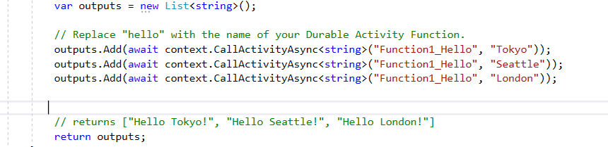

# Basic Durable Function

- This project is nothing but the durable function code created at default.

- Function1_HttpStart is the starter function (Http trigger) which calls Function1 (Orchestrator function).

- The Orchestrator function same Activity Trigger (Function1_Hello) is called thrice.

 

 

 
- When the Activity Trigger is called the Orchestration is paused and is only resumed when the activity is completed. The use of await keyword ensures this.

-Every time the Orchestrator function is resumed it starts right from the beginning of the code and traverses till the execution has been completed, and then triggers the fucntion next in line for execution.

- The output returned is ["Hello Tokyo!", "Hello Seattle!", "Hello London!"] 

 
