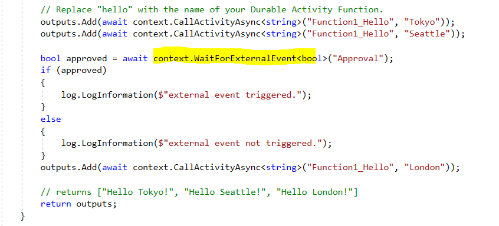
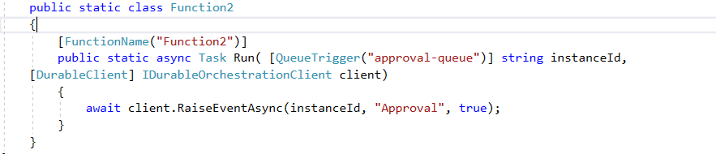

# Durable Function with External Event

- With this pattern the orchestrator function will be paused until the external event is called.

 

 

 

- With this example the external event (Function 2) is a queue trigger that excepts the instance id of the invocation.
 
 

 

 
 
 
 
- If this external event is not triggered the orchestrator function can indefinitely wait. However, this condition can be handled with a **CreateTimer Event**.
